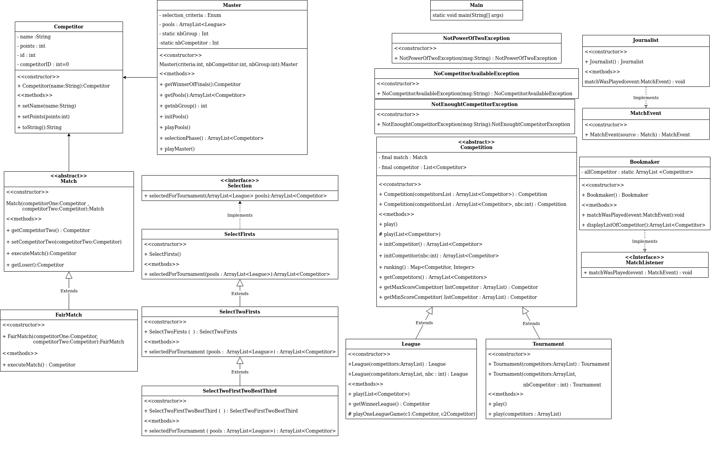

# Simulation d'une competition sportive en Java	

Binôme :  
* BOUAOUD Malik G2A 
* ADAMCZAK Loïne G2A

Rendu du 11/10/2020

Fait avec Eclipse et Java 8 

## Introduction : 

Ce logiciel simule une compétition sportive. Elle est définie par un ensemble de matchs (``Match``) joués entre compétiteurs (``Competitor``). 

**Équipes participantes**

###### Competiteur (``Competitor``) :
Un competiteur est défini par un nom (String) et un nombre de point (Integer)

**Type de competition**

Deux types de competition sont possibles :

###### League (``League``) :
Chaque équipes (``Competitor``) rencontre deux fois le reste des équipes (matchs allé/retour)
Gagner un match à domicile (le premier competiteur entré en argument dans ``playMatch()``) remporte 1 point
À l'inverse gagner un match à l'exterieur (le deuxième competiteurr entré en argument) remporte 2 points.
À l’issue du championnat, le vainqueur est donc le compétiteur ayant cumulé le plus de points.

###### Tournoi (``Tournament``)  :
Chaque match est éliminatoire : les gagnants des matchs s'affrontent aux tours suivants jusqu'a
ce qu'il ne reste plus qu'un seul competiteur, qui devient ainsi le vaincueur de la competition.

##### Master (``Master``) : /!\ Attention Master n'hérite pas de la classe `Competition`

Cette competition se déroule en deux phases : une phase de poules à l’issue de laquelle certains compétiteurs sont sélectionnés pour dis-
puter la phase finale du tournoi. La méthode de sélection des compétiteurs (``Selection``) retenus pour disputer la phase finale du `Master` est précisée à la création du
Master. Le vainqueur du Master est le compétiteur finissant vainqueur de la phase finale. L’affichage du classement d’un Master fait
apparaitre le classement de chacune des poules, ainsi que le classement de la phase finale.

**Déroulement d'un match**

###### Match (``Match``) : 
Il y a forcément un gagnant par match obtenu de manière aléatoire. Pas de match truqué pour l'instant (les compétiteurs ont la même chance de gagner)

**Classement des équipes**

###### Classement (``ranking()``) :
À la fin de chaque compétition un classement apparait affichant dans l'ordre les équipes avec leurs points 

## HowTo : 

Adresse git du depot : [https://gitlab-etu.fil.univ-lille1.fr/adamczak/coo_competition_sportive.git](https://gitlab-etu.fil.univ-lille1.fr/adamczak/coo_competition_sportive.git)

**Récupération du Projet/Depot :**

Créer un dossier : 
>mkdir binomeG2AML

Se placer dans le dossier : 
>cd binomeG2AML

Création du git : 
>git init

cloner le dépot git (récupérer le projet) : 
>git clone https://gitlab-etu.fil.univ-lille1.fr/adamczak/coo_competition_sportive.git

**Génération de la JAVADOC :**

se placer dans le dossier principal "coo_competition_sportive" et lancer la commande suivante :

>javadoc -Xdoclint:none -d doc -sourcepath src -subpackages entity services  util mainpackage exceptions

Un dossier doc est crée contenant toute la java doc nous vous conseillons d'aller directement consulté le fichier "allpackages-index.html" qui vous permettra de parcourir le reste du projet 

**Création de l'archive JAR :**

--étape 1:--

>mkdir build | javac -d build src/entity/*.java src/util/*.java  src/services/*.java src/observer/*.java src/exceptions/*.java src/mainpackage/*.java

*Permet de créer un dossier Build et compiler nos fichier.java, les fichiers.Class seront mis dans le répertoire Build.*

--étape 2:--

*Se placer dans le répertoire build*
>cd build

*puis lancer la commande suivante*
>jar cvfe pcom.jar mainpackage/Main */*.class 
 

*l'archive du projet "pcom.jar" est crée pas besoin de fichier MANIFEST.mf puisque nous utilisons l'option e de Jar *

**Lancement du Jar exécutable**

*toujours dans le répertoire Build lancez la commande suivante pour lancer l'exécution du programme*

>java -jar pcom.jar

** Nettoyage du dépôt  :**
>rm -rf build

## Architecture du code :

#### Organisation des packages : 

Le code est ogranisé en plusieurs packages (utilisation de nom de paquetage sémantiques et discriminants):

__Dossier Source `src` :__ 

**entity :**
* ``Competitor.Java``

**services :**
* ``Competition.Java``
* ``League.Java``
* ``Tournament.Java``
* ``Match.Java``
* ``FairMatch.Java``
* ``Master.Java``
* ``Selection.Java``
* ``SelectFirsts.Java``
* ``SelectTwoFirsts.Java``
* ``SelectTwoFirstTwoBestThird.Java``

**exceptions :**
* ``NoCompetitorAvailableException.java``
* ``NotEnoughCompetitorException.java``

**mainpackage :**
* ``main.java``

**observer :**
* ``MatchListener.Java``
* ``MatchEvent.Java``
* ``Journalist.Java``
* ``Bookmaker.Java``

__Dossier Test `test` :__ 

**mock :**
* ``MockCompetition.java``
* ``MockLeague.java``
* ``MockTournament.java``
* ``MockMatch.java``
* ``MockMaster.java``

**junitTest :**
* ``CompetitorTest.java``
* ``CompetitionTest.java``
* ``LeagueTest.java``
* ``TournamentTest.java``
* ``MatchTest.java``
* ``FairMatchTest.java``
* ``MasterTest.java``

#### Polymorphisme :

Utilisation de polymorphisme -> ``Competition``  est une classe abstraite représentant une compétition (soit une league, soit un tournoi).

les classes League et Tournament `extends` Competition et chaque classe redéfini les méthodes ``play()`` et ``playMatch()``.

#### Classe Match abstraite :

Le code est prêt à envisager plusieurs type de Match (matchs “pondérés” où un compétiteur part favori,
matchs truqués...). En effet dans le code, Match est déjà abstrait. Utilisation de ``FairMatch`` pour créer un match équitable.

#### Exceptions : 

Utilisation de throws et création d'exception personnalisé (exemple : NoCompetitorAvailableException.class dans le package exception).

#### Tests : 

Pour run les tests de Master il faut entrer mannuellement les noms des competiteurs.

## Princip Solid : 

Tout le long du projet nous avons essayé d'appliquer les principes solid :

Notre code est ouvert aux extensions mais fermé aux modifications. Par exemple comme dit precedemment nous avons choisi de faire la classe match abstraite
pour pouvoir créer toute sorte de match sans modifier directement la classe Match. Autre exemple avec les critères de selections pour disputer 
la phase finale d'un Master : l'utilisation de l'interface `Selection` permet d'ajouter autant de critère de selection au code sans à avoir à toucher au code
de `Selection` ou même de `Master`.

Les sous-classes peuvent remplacer leur classe de base.

Nous essayons de faire en sorte de garder le code le plus simple possible.

Pas de repetition de code.

Aucune fonctionnalité superflue.

**OCP (Open Closed Principle) **

**LSP (Principe de substitution de Liskov) **

**KISS (Keep It Simple, Smart) ** 

**DRY (Don't Repeat Yourself) **

**YAGNI (You Ain’t Gonna Need It) :**

## Design Pattern : 

**Factory method**
Notament avec la création d'une classe abrstaite pour ``Competition`` qui est étendu avec `` Tournament`` et ``League``. 

Mais aussi avec ``Match`` aussi puique on a une classe ``FairMatch`` qui implémente match dont le but était de pouvoir ajouter plus facilement par la suite les match truqués, etc.//

**Strategy**
Notament avec la création de l'interface Selection et son implémentation par plusieurs autres classes suivant le critère de selection

**Observer**
``MatchListener.Java`` représente l'interface listener de notre 
code qui serra implémenté par nos classes réceptrices.

``MatchEvent.Java`` représent la classe d'évennement et étend la classe
EventObject.

``Bookmaker.Java`` & ``Journalist.Java`` sont nos classes réceptrices qui implémentent la classe MatchListener et donc redifinient la méthode 
``matchWasPlayed`` .

Concernant la classe source il s'agit de classe FairMatch qui étend la classe match, nous avons ajouter les méthodes suivante :
``add``&``remove``&``fireListener``.

Les appels se font en ajoutant les MatchListener (Bookmakers et journalistes) au début de la méthode execute match, et à chaque fois que l'on a un résultat on prévient les classes réceptrices en appellant la méthode ``fireListener`` 
pour dire que l'on a un gagnant et que les observeurs ont un travail à faire (executer chacun ``matchWasPlayed``).

Nous avons aussi ajouté un attribut cote dans la classe ``Competitor.java`` qui est initialisé à chaque fois au nombre total des participants de la compétition

## Diagramme UML du projet : 

  

Créer avec Draw.io

